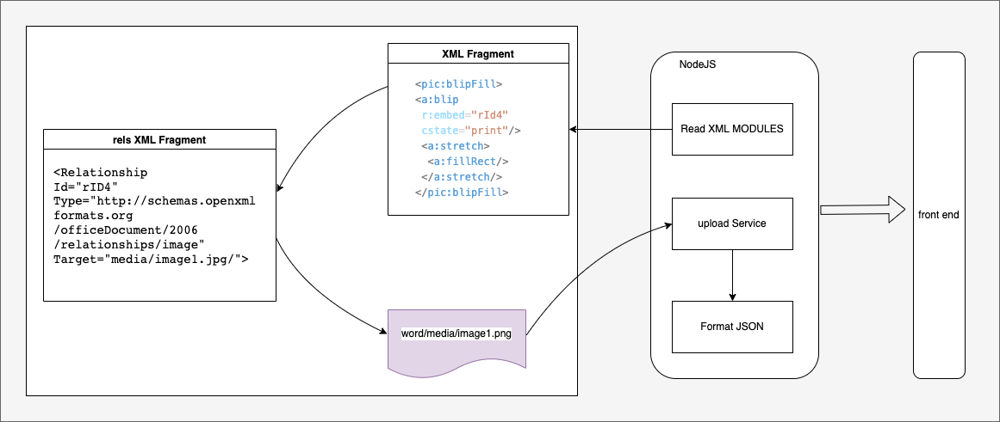
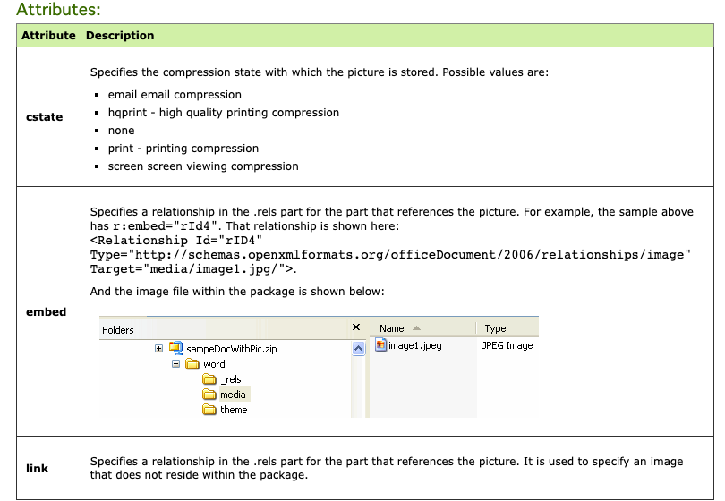

# docx解析图片流程

## docx图形的设计



## DrawingML

DrawingML is the language for defining graphical objects such as pictures, shapes, charts, and diagrams（图表） within ooxml documents. It also specifies package-wide appearance characteristics（指定了包装范围的外观特征）, i.e., the package's theme. DrawingML is not a standalone markup language; it supports and appears within wordprocessingML, spreadsheetML, and presentationML documents. DrawingML is distinct from SVG and VML. SVG (scaleable vector graphics) is a graphics file format for two-dimensional（二维） graphics in XML. It is used mostly on the web and in desktop publishing. VML is a competing language for vector graphic files. It is now largely deprecated（弃用） in favor of SVG. According to the ECMA OOXML specification, "The DrawingML format is a newer and richer format created with the goal of eventually replacing any uses of VML in the Office Open XML formats. VML is a transitional format; it is included in Office Open XML for legacy reasons only." VML is still used extensively within Microsoft Word for certain graphic comnponents, in particular for things as shapes and text boxes.


[drawingml](http://officeopenxml.com/drwOverview.php)


## Placement within Docs


## Inline objects

Inline objects are inline with the text and affect the line height and layout of the line, just as a character of the same size would affect the line. They are inserted into a <w:drawing> element with a <wp:inline> element


| element | descrption |
| --- | --- |
| cNvGraphicFrame | 用以控制图片是否被 lock, 控制 选中 缩放 拖拉 ｜
｜ docPr | ```<wp:docPr id="222" name="Blue hills.jpg" title="This is the title" descr="This is the description"``` id name title descr/> | 
| extend | cx cy 定义图片的矩形宽高 


## Floating objects


## Image Data

The image data for a picture is specified with the <a:blip> element within the <pic:blipFill> element (BLIP = binary large image or picture). Note the namespace used is xmlns:a="http://schemas.openxmlformats.org/drawingml/2006/main". The image data can be stored locally within the same file, or linked to a location outside of the file. The state of compression for the data is also specified. All of this information is contained within the attributes for <a:blip>.




```xml
<pic:blipFill>
    <a:blip r:embed="rId4" cstate="print"/>
    <a:stretch>
        <a:fillRect/>
    </a:stretch/>
</pic:blipFill>
```

## xml构成

```xml
<w:drawing>
    <wp:inline distT="0" distB="0" distL="0" distR="0" wp14:anchorId="68A30B24" wp14:editId="51EF5A8A">
        <wp:extent cx="5274310" cy="1085215"/>
        <wp:effectExtent l="0" t="0" r="2540" b="635"/>
        <wp:docPr id="5" name="图片 5"/>
        <wp:cNvGraphicFramePr>
            <a:graphicFrameLocks xmlns:a="http://schemas.openxmlformats.org/drawingml/2006/main" noChangeAspect="1"/>
        </wp:cNvGraphicFramePr>
        <a:graphic xmlns:a="http://schemas.openxmlformats.org/drawingml/2006/main">
            <a:graphicData uri="http://schemas.openxmlformats.org/drawingml/2006/picture">
                <pic:pic xmlns:pic="http://schemas.openxmlformats.org/drawingml/2006/picture">
                    <pic:nvPicPr>
                        <pic:cNvPr id="1" name=""/>
                        <pic:cNvPicPr/>
                    </pic:nvPicPr>
                    <pic:blipFill>
                        <a:blip r:embed="rId7"/>
                        <a:stretch>
                            <a:fillRect/>
                        </a:stretch>
                    </pic:blipFill>
                    <pic:spPr>
                        <a:xfrm>
                            <a:off x="0" y="0"/>
                            <a:ext cx="5274310" cy="1085215"/>
                        </a:xfrm>
                        <a:prstGeom prst="rect">
                            <a:avLst/>
                        </a:prstGeom>
                    </pic:spPr>
                </pic:pic>
            </a:graphicData>
        </a:graphic>
    </wp:inline>
</w:drawing>
```

## 参考

- [ooxml](http://officeopenxml.com/drwPic-ImageData.php)